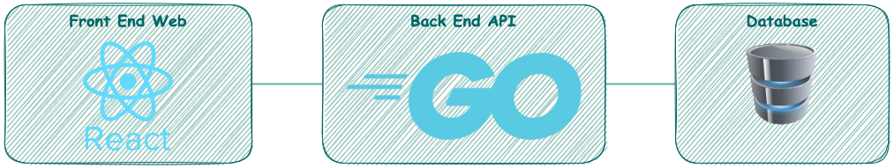
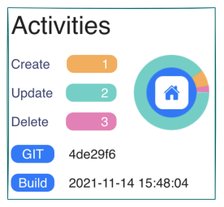

# Applications

## Prerequisites

|                                               Tool | Check                      |
| -------------------------------------------------: | :------------------------- |
|                  [Docker](https://www.docker.com/) | `docker --version`         |
| [Docker Compose](https://docs.docker.com/compose/) | `docker-compose --version` |

## Architecture

## Activities Stack

1. create the stack `docker-compose -f activities/docker-compose.yml up --force-recreate --abort-on-container-exit`
2. open the web application on http://localhost:8082/

> Lear more about [How to Build & Run Activities Stack](activities/README.md)

## Helm Resources Stack
