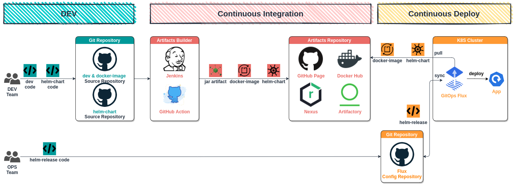

# CI/CD Overview

> Integrating and Deploying new code can cause **time-consuming problems** for development and operations teams.

That's why we ***orchestrate the CI/CD pipelines*** ([continuous integration](#ci)/[continuous deploy](#cd)) comprising with [Jenkins](#jenkins), [Nexus](#nexus), [Artifactory](#artifactory), [Flux](#flux), etc.

On the path towards the automation, we ***have boosted the deployment of*** [CI/CD pipeline as code](#pipeline-as-code) and ***look forward to automate moreover***.

## CI

> An **artifact** is a deployable component of your application, such as *jar*, *docker-image* and *helm-chart*.

## CD

## GitOps & Flux

- DEV uses Git to deploy new features to K8S cluster
- The same workflows are maintained across DEV and OPS teams.
- All changes can be triggered, stored, validated and audited in Git.
- Operational changes are
  - made by pull request on Git *(including rollbacks)*
  - observed and monitored on Git
