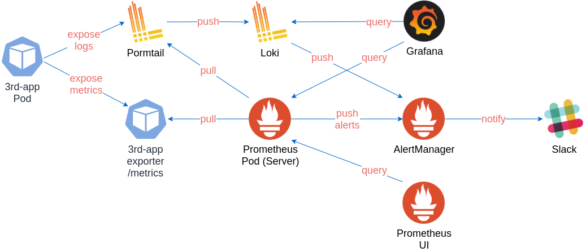
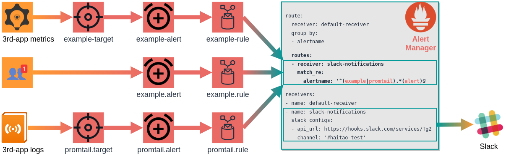
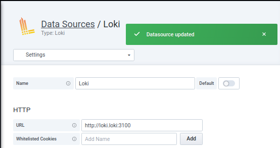

# Monitoring Overview

see [Prometheus-Grafana-Loki Stacks](../tools/prometheus-grafana-loki/README.md)

## K8S CPU and Memory Metrics

CPU resources are measured in CPU cores while memory is measured in bytes

| type       | Aggregation                 | desc                                               |
| :--------- | --------------------------- | -------------------------------------------------- |
| Pods       | `sum by (service,pod)`      | collections of containers                          |
| Nodes      | `sum by(service,node)`      | all pods running on that node                      |
| Namespaces | `sum by(service,namespace)` | all pods that belong to that namespace             |
| Clusters   | `sum by(service)`           | all pods running on nodes belonging to the cluster |

Example

```text
if
  1 N1-standard-1 instance has 2 vCPUs and 3.75 GB of memory
then
  a cluster with 4 N1-standard-1 instances has 8vCPUs and 15 GB of memory
```

| type       | cpu                                              | mem                                                 | desc                                                                 |
| :--------- | ------------------------------------------------ | --------------------------------------------------- | -------------------------------------------------------------------- |
| usage      | `irate(container_cpu_usage_seconds_total[1m])`   | `container_memory_usage_bytes`                      | the amount of resources a container has consumed                     |
| requests   | `kube_pod_container_resource_requests_cpu_cores` | `kube_pod_container_resource_requests_memory_bytes` | a **soft** limit on the amount of resources a container can consume  |
| limits     | `kube_pod_container_resource_limits_cpu_cores`   | `kube_pod_container_resource_limits_memory_bytes`   | a **hard** limit on the amount of resources a container can consume  |
| capacity   | `node:node_num_cpu:sum`                          | `node_memory_MemTotal_bytes`                        | the total number of `CPU cores`/`Memory bytes available` on the node |
| saturation | `node:node_cpu_saturation_load1:`                |                                                     | the total number of `CPU cores`/`Memory bytes available` on the node |

- K8S Resource Request Commitment (Resource Requests vs Capacity)
  Request commitments give us an idea of how much of the node or cluster is committed in terms of soft resource usage limits

- K8S Resource Limit Commitment (Resource Limits vs Capacity)
  Limit commitments give us an idea of how much of the node or cluster is committed in terms of hard CPU and memory limits

- K8S Resource Utilization (Resource Usage vs Capacity)

- K8S Resource Saturation (Resource Requests vs Unavailability)

## Architecture

|     component | function                                                                       |
| ------------: | :----------------------------------------------------------------------------- |
|      Promtail | gather & push logs to Loki                                                     |
|          Loki | store logs and process queries(LogQL)                                          |
|       Grafana | query and display the logs                                                     |
|    Prometheus | collect metrics & rise alerts & process queries (PromQL)                       |
| Alert Manager | handles alerts<li>deduplicate & group & route to receiver<li>silence & inhibit |



## Prometheus & Alert Manager

Prometheus Rule fires alert when the specific event is detected.
It fires alert against all Alertmanager instances, on every rule evaluation interval.



Check from UI

- Prometheus ‣ Status ‣ Rules
- Prometheus ‣ Alerts

## Promtail & Loki

[POST /loki/api/v1/push](https://grafana.com/docs/loki/latest/api/#post-lokiapiv1push) is the endpoint used to send log entries to Loki.

<details close=""> <summary>promtail push to loki</summary>

```yaml
---
# Source: loki-stack/charts/promtail/templates/daemonset.yaml
apiVersion: apps/v1
kind: DaemonSet
metadata:
  name: tracer-promtail
  namespace: monitoring
spec:
  template:
    spec:
      containers:
        - name: promtail
          image: "grafana/promtail:2.1.0"
          imagePullPolicy: IfNotPresent
          args:
            - "-config.file=/etc/promtail/promtail.yaml"
            - "-client.url=http://tracer-loki:3100/loki/api/v1/push"
---
# Source: loki-stack/charts/loki/templates/service.yaml
apiVersion: v1
kind: Service
metadata:
  name: tracer-loki
  namespace: monitoring
spec:
  ports:
    - port: 3100
      protocol: TCP
      name: http-metrics
      targetPort: http-metrics
```

</details>

## Promtail & Prometheus

TODO

## Loki & Alert Manager

`loki.config.ruler.alertmanager_url` is the alertmanager endpoint to send notifications to

- [Loki Alerting](https://grafana.com/docs/loki/latest/alerting/)
- [How to Setup Alerting with Loki](https://dev.to/ruanbekker/how-to-setup-alerting-with-loki-kmj)
- [Transform logs as you’re querying them, and set up alerts within Loki](https://grafana.com/blog/2020/10/28/loki-2.0-released-transform-logs-as-youre-querying-them-and-set-up-alerts-within-loki/)

## Grafana & Datasources

Add `loki` data source:

| syntax                                                 | sample                               |
| :----------------------------------------------------- | ------------------------------------ |
| `http://$LOKI_SERVICE_NAME.$LOKI_NAMESPACE:$LOKI_PORT` | `http://tracer-loki.monitoring:3100` |

<details close=""> <summary>datasource</summary>



</details>

## Resources

Kubernetes Resources

- [Managing Resources for Containers](https://kubernetes.io/docs/concepts/configuration/manage-resources-containers)
- [Configure Default Memory Requests and Limits for a Namespace](https://kubernetes.io/docs/tasks/administer-cluster/manage-resources/memory-default-namespace/)
- [Manage Memory, CPU, and API Resources](https://kubernetes.io/docs/tasks/administer-cluster/manage-resources/)

Kubernetes Monitoring - The Ultimate Guides

- [Guide to Monitoring Resource Metrics with Prometheus](https://www.replex.io/blog/kubernetes-in-production-the-ultimate-guide-to-monitoring-resource-metrics)
- [Guide to Monitoring Resource Metrics with Grafana](https://www.replex.io/blog/kubernetes-in-production-the-ultimate-guide-to-monitoring-resource-metrics-with-grafana)

Queries

- [PromQL Cheat Sheet](https://promlabs.com/promql-cheat-sheet/)
- [PromQL For Humans](https://timber.io/blog/promql-for-humans/)
- [Grafana Dashboards from Basic to Advanced](https://www.metricfire.com/blog/grafana-dashboards-from-basic-to-advanced/)
