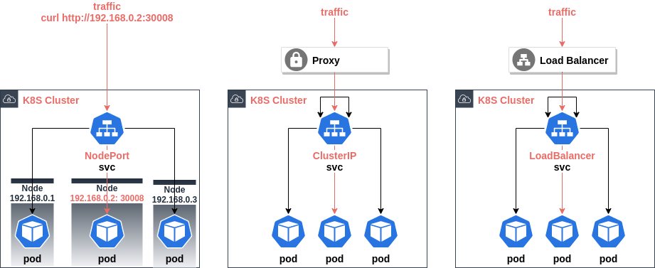

# K8S Service



create two http-echo pods

```bash
kubectl run foo --image=hashicorp/http-echo:0.2.3 --labels=app=echo -- "-text=foo"
kubectl run bar --image=hashicorp/http-echo:0.2.3 --labels=app=echo -- "-text=bar"
```

## LoadBalancer service

create a LoadBalancer service routing to http-echo pods

```bash
kubectl expose pod foo --name foo-bar-echo --type=LoadBalancer  --selector=app=echo --port=1234 --target-port=5678

LB=$(kubectl get svc/foo-bar-echo -o=jsonpath='{.status.loadBalancer.ingress[0].ip}:{.spec.ports[0].port}')
for i in {1..10}; do curl ${LB}; done
```

## NodePort Service

create a NodePort service routing to http-echo pods

```bash
kubectl expose pod foo --name foo-bar-echo2 --type=NodePort     --selector=app=echo --port=1234 --target-port=5678

URL=$(docker container inspect play-control-plane --format '{{ .NetworkSettings.Networks.kind.IPAddress }}')
PORT=$(kubectl get svc/foo-bar-echo2 -o=jsonpath='{.spec.ports[0].nodePort}')
for i in {1..10}; do curl ${URL}:${PORT}; done
```
