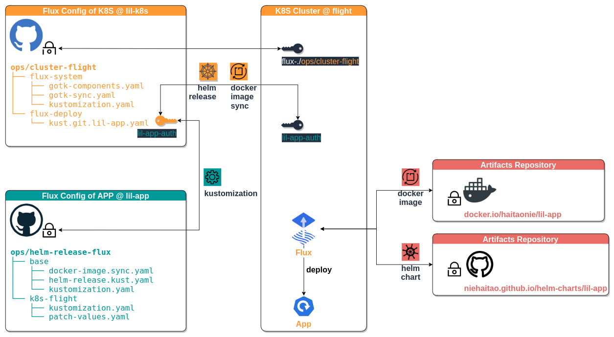

# Operations

Scenario

- K8S Cluster **flight**
- GitOps Tool **flux**
- [Git Repository as Sources](https://toolkit.fluxcd.io/core-concepts/#sources) 
  - **lil-k8s**
  - **lil-app** for the kustomization
- **lil-k8s** and **lil-app** define the `kustomization`



## FLUX-APP-CONFIG

create the access of **lil-app** on **flight**

```bash
export FLUX_APP_NAME='lil-app'
export FLUX_APP_NAMESPACE='flux-deploy'

export FLUX_APP_REPO='https://github.com/niehaitao/lil-app'
export FLUX_APP_REPO_AUTH='lil-app-repo-auth'

kubectl create namespace ${FLUX_APP_NAMESPACE}

kubectl create secret generic ${FLUX_APP_REPO_AUTH} \
  --namespace ${FLUX_APP_NAMESPACE}                 \
  --from-literal "username=${GITHUB_USER}"          \
  --from-literal "password=${GITHUB_TOKEN}"
```

### « FLUX-K8S-CONFIG

**lil-k8s** uses **lil-app** to create the `kustomization`

```bash
export K8S_GIT_CONFIG='lil-k8s/ops/cluster-flight/flux-deploy/kust.git.lil-app.yaml'

flux create source git ${FLUX_APP_NAME} \
  --namespace   ${FLUX_APP_NAMESPACE}   \
  --secret-ref  ${FLUX_APP_REPO_AUTH}   \
  --url         ${FLUX_APP_REPO}        \
  --branch      main                    \
  --interval    30s                     \
  --export >>   ${K8S_GIT_CONFIG}

export FLUX_APP_PATH='ops/helm-release-flux/k8s-flight'
curl -s --head "${FLUX_APP_REPO}/blob/main/${FLUX_APP_PATH}" | head -n 1

flux create kustomization ${FLUX_APP_NAME}  \
  --namespace   ${FLUX_APP_NAMESPACE}       \
  --source=${FLUX_APP_NAME}                 \
  --path=${FLUX_APP_PATH}                   \
  --prune=true                              \
  --validation=client                       \
  --interval=1m                             \
  --health-check="Deployment/${FLUX_APP_NAME}.${FLUX_APP_NAMESPACE}" \
  --export >> ${K8S_GIT_CONFIG}
```

### « K8S-CLUSTER

#### HELM RELEASE

**lil-app** uses the **helm charts repository**

```bash
export APP_CONFIG='lil-app/ops/helm-release-flux/base/helm-release.kust.yaml'
export APP_HELM_REPO='https://niehaitao.github.io/helm-charts'
flux create source helm ${FLUX_APP_NAME}                     \
  --url=${APP_HELM_REPO} \
  --interval=30s                                \
  --export >> ${APP_CONFIG}

flux create helmrelease ${FLUX_APP_NAME}   \
  --source=HelmRepository/${FLUX_APP_NAME} \
  --release-name ${FLUX_APP_NAME}          \
  --chart=lil-app             \
  --interval=10m              \
  --export >> ${APP_CONFIG}
```

#### Image Automation

```bash
export SYNC_CONFIG='lil-app/ops/helm-release-flux/base/docker-image.sync.yaml'

flux create image repository  ${FLUX_APP_NAME}      \
  --image=docker.io/haitaonie/lil-app \
  --interval=1m                       \
  --export  >> ${SYNC_CONFIG}

flux create image policy   ${FLUX_APP_NAME}    \
  --image-ref=${FLUX_APP_NAME}                     \
  --select-semver=1.0.x               \
  --export  >> ${SYNC_CONFIG}

flux create image update ${FLUX_APP_NAME}  \
--git-repo-ref=${FLUX_APP_NAME}            \
--branch=main                         \
--author-name=fluxcdbot               \
--author-email=fluxcdbot@users.noreply.github.com \
--commit-template="[ci skip] update image"        \
--export  >> ${SYNC_CONFIG}
```
