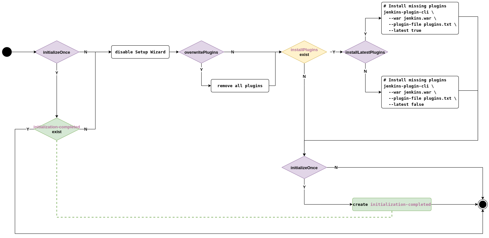

# Jenkins

Use [data/values.yaml](data/values.yaml) to install [Jenkins Helm Chart](https://github.com/jenkinsci/helm-charts/tree/main/charts/jenkins)

## Check plugins upgrade

Use [data/check-plugins-upgrade.sh](data/check-plugins-upgrade.sh) to check the upgrade of Jenkins Plugins

```bash
./data/check-plugins-upgrade.sh   \
  -f data/values.yaml             \
  -p controller.installPlugins    \
  -v 3.2.5

./data/check-plugins-upgrade.sh   \
  -f data/values.yaml             \
  -p controller.additionalPlugins \
  -v 3.2.1
```

## Jenkins Helm Chart

Use [data/values.yaml](data/values.yaml) to install Jenkins Helm Chart

```bash
helm upgrade -n app -i contractor jenkins  \
  --repo https://charts.jenkins.io  \
  --version 3.3.21 \
  -f data/values.yaml

kubectl wait pod        \
  --namespace app       \
  --for condition=ready \
  --timeout 90s         \
  --selector app.kubernetes.io/instance=contractor

kubectl exec          \
  --namespace app     \
  -it svc/contractor  \
  -c jenkins          \
  -- /bin/cat /run/secrets/chart-admin-password && echo
```

Use [data/ingress.yaml](data/ingress.yaml) to expose HTTP & HTTPs routes

```bash
kubectl apply -f data/ingress.yaml

wget https://jenkins.kind.io --no-check-certificate --spider
wget  http://jenkins.kind.io --no-check-certificate --spider

curl https://jenkins.kind.io -ikL
curl  http://jenkins.kind.io -ikL
```

## Config As Code

### Plugins

[How Jenkins applies config](https://github.com/jenkinsci/helm-charts/blob/874a303098698e314611e8256d8b5898a7d1d824/charts/jenkins/templates/config.yaml#L14)

<details close="">

| Parameter                              | Description                                                                                                                             | Default                                                                          |
| -------------------------------------- | --------------------------------------------------------------------------------------------------------------------------------------- | -------------------------------------------------------------------------------- |
| `controller.installPlugins`            | List of Jenkins plugins to install. If you don't want to install plugins set it to `false`                                              | `kubernetes:1.29.2 workflow-aggregator:2.6 git:4.7.1 configuration-as-code:1.47` |
| `controller.additionalPlugins`         | List of Jenkins plugins to install in addition to those listed in controller.installPlugins                                             | `[]`                                                                             |
| `controller.initializeOnce`            | Initialize only on first install. Ensures plugins do not get updated inadvertently. Requires `persistence.enabled` to be set to `true`. | `false`                                                                          |
| `controller.overwritePlugins`          | Overwrite installed plugins on start.                                                                                                   | `false`                                                                          |
| `controller.overwritePluginsFromImage` | Keep plugins that are already installed in the controller image.                                                                        | `true`                                                                           |
| `controller.installLatestPlugins`      | Set to false to download the minimum required version of all dependencies.                                                              | `false`                                                                          |



</details>
