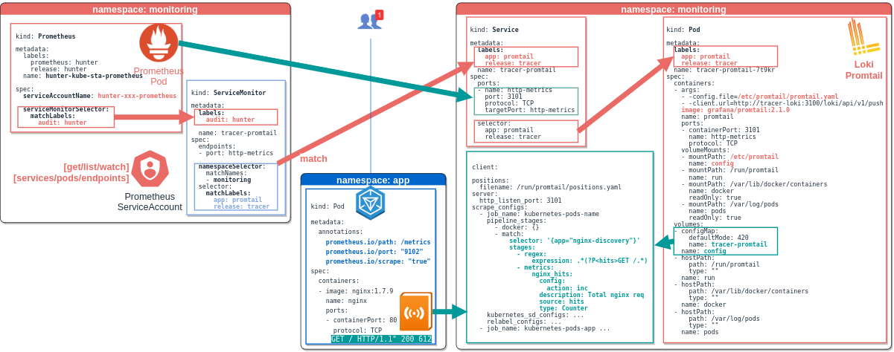

# Loki Stack



## configuration

```bash
kubectl -n monitoring get secret tracer-loki -o json | \
  jq -r '.data."loki.yaml"' | base64 --decode ; echo
```

## test

`nginx-discovery` is a 3rd App(nginx) to audit created at [Install 3rd App nginx-discovery](installation.md#install-3rd-app-nginx-discovery)

<details close=""> <summary>hit it</summary>

```console
$ 3rd_app_host=https://nginx-discovery.kind.io/
$ while true; do curl -s -o /dev/null -w '%{http_code}' ${3rd_app_host}; sleep 5; echo; done
200
200
```
  
</details>

<details close=""> <summary>log it</summary>

```console
$ kubectl -n app logs --tail=10 deploy/nginx-discovery
10.1.165.3 - - [15/Mar/2021:10:42:13 +0000] "GET / HTTP/1.1" 200 612 "-" "curl/7.58.0" "10.1.172.231"
10.1.165.3 - - [15/Mar/2021:10:42:19 +0000] "GET / HTTP/1.1" 200 612 "-" "curl/7.58.0" "10.1.172.231"
```

</details>

<details close=""> <summary>expose it: 3rd-app-log > promtail ></summary>

```yaml
annotations:
  prometheus.io/scrape: "true"
  prometheus.io/port: "9102"
  prometheus.io/path: "/metrics"
```

</details>

## Resources

- [Grafana : Loki LogQL](https://www.youtube.com/watch?v=7h1-YMFjldI)
