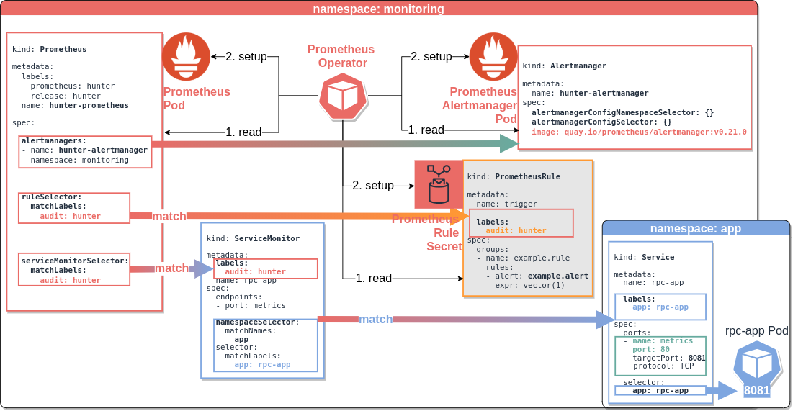
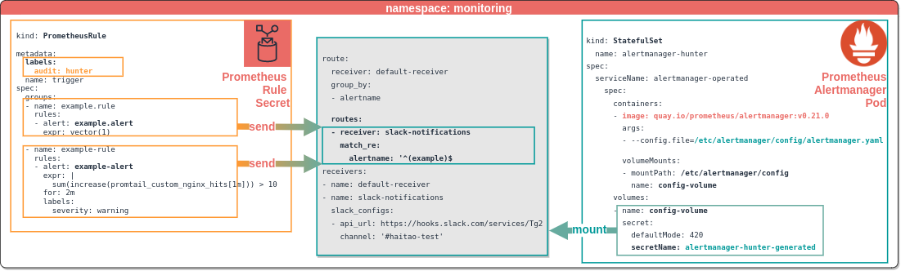

# Prometheus Stack

## 1. Prometheus Operator

`Prometheus Operator` apply on the ***Custom Resource Definition*** to orchestrate the setup of ***K8S Resource***

<details close=""> <summary>CRDs</summary>
<iframe width="900" height="500" src="https://www.youtube.com/embed/QoDqxm7ybLc" frameborder="0" allowfullscreen></iframe>

|              CRD | ***K8S Resource***                     |
|-----------------:|----------------------------------------|
|     `Prometheus` | `Prometheus deployment`                |
|   `Alertmanager` | the setup of alertmanager              |
| `ServiceMonitor` | the targets of service to be monitored |
|     `PodMonitor` | the targets of pod to be monitored     |

```bash
kubectl -n monitoring get prometheus,alertmanager,prometheusrule,servicemonitor

kubectl -n monitoring get daemonset,statefulset,deploy
```

</details>



- See [Prometheus Operator - Getting Started](https://github.com/prometheus-operator/prometheus-operator/blob/master/Documentation/user-guides/getting-started.md)
- See [Prometheus Operator - Helm Chart](https://github.com/prometheus-operator/prometheus-operator)

## 2. Prometheus Server

```bash
kubectl -n monitoring -o json get prometheus | jq -r '.. | .alerting?.alertmanagers | select(.)[] | (.name, .namespace)'
# []
kubectl get -n monitoring -o json prometheus | jq -r '.. | .serviceMonitorSelector? | select(.)'
# { "matchLabels": { "audit": "hunter" } }
kubectl -n monitoring -o json get prometheus | jq -r '.. | .ruleSelector? | select(.)'
# { "matchLabels": { "audit": "hunter" } } 
```

- see [Prometheus Server - Helm Chart](https://github.com/prometheus-community/helm-charts/tree/main/charts/prometheus)
- see [Prometheus Server - Installation](installation.md)

## 3. Prometheus Alertmanager

Alertmanager reads its configuration from a config.yaml file mounted from a secret.

<details open="">



```bash
kubectl -n monitoring -o yaml get statefulset alertmanager 

kubectl -n monitoring -o json get secret alertmanager-hunter-generated \
| jq -r '.. | .data?."alertmanager.yaml" | select(.)' | base64 --decode ; echo
```

</details>

- see [Alertmanager - Helm chart](https://github.com/prometheus-community/helm-charts/tree/main/charts/alertmanager)

## 4. Prometheus Rule

`trigger` is a Prometheus Rule created from [rules.yaml](data/prom/rules.yaml)
| rule name    | event                                                | alert name    |
|--------------|------------------------------------------------------|---------------|
| example.rule | `vector(1)` immediately for demonstration purposes   | example.alert |
| example-rule | `sum(increase(promtail_custom_nginx_hits[1m])) > 10` | example-alert |

<details open=""> <summary>setup</summary>

```bash
kubectl -n monitoring apply -f data/prom/rules.yaml
kubectl -n monitoring get   prometheusrules
```

</details>

<details open=""> <summary>match prometheus server & rules</summary>

```bash
kubectl -n monitoring -o json get prometheus              | jq -r '..|.ruleSelector?| select(.)'
# { "matchLabels": { "audit": "hunter" } }

kubectl -n monitoring -o json get prometheusrules trigger | jq -r '..|.labels?|select(.audit)'
# { "audit": "hunter" }
```

</details>

## 5. Prometheus ServiceMonitor

The `ServiceMonitor` identification by `Prometheus` by **`tag`** (see [description](https://github.com/prometheus-operator/prometheus-operator/blob/master/Documentation/troubleshooting.md#overview-of-servicemonitor-tagging-and-related-elements))

<details open=""> <summary>match prometheus server & ServiceMonitor</summary>

```bash
kubectl get -n monitoring -o json prometheus              | jq -r '.. | .serviceMonitorSelector?| select(.)'
# { "matchLabels": { "audit": "hunter" } }
kubectl get -n monitoring -o json servicemonitor rpc-app  | jq -r '.. | .labels?|select(.)|.audit'
# hunter
kubectl get -n monitoring -o json servicemonitor rpc-app  | jq -r '.. | (.namespaceSelector, .selector)? | select(.)'
# { "matchNames": [ "app" ] }
# { "matchLabels": { "app": "rpc-app" } }
kubectl get all -n app -l app=rpc-app
```

</details>
